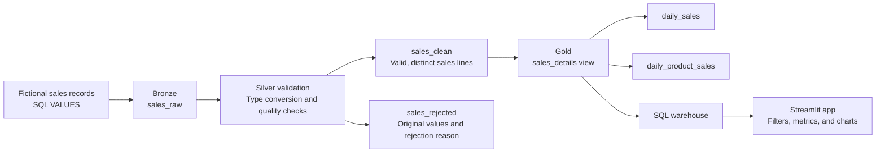

# Sales Insights

A sales analytics application built with Databricks, SQL, and Streamlit. It takes a small set of raw sales records through a Bronze, Silver, and Gold pipeline, then makes the cleaned data available through an interactive dashboard.

I built this as my first Databricks application to understand how the pieces fit together: preparing data, handling quality issues, defining useful metrics, and deploying an app that can query them.


*Dashboard overview from the deployed application, using fictional sales data. All amounts are in GBP.*

[Architecture](#architecture) · [Run the project](#run-the-project) · [Validate the results](#validate-the-results) · [Next steps](#next-steps)

## What the app does

The dashboard helps answer three straightforward questions: how much revenue was recorded, how it changed across the selected dates, and which products contributed to it.

- Filter sales by date range and product category.
- View revenue, distinct orders, and units sold for the selection.
- Compare daily revenue and revenue by product.
- Inspect the individual sales lines behind the totals.
- Refresh the data, with messages for empty results and loading failures.

The sample covers **1–3 September 2026** across Electronics, Furniture, and Stationery. With all filters selected, the app shows **£470 revenue, 6 orders, and 19 units sold**.

## Why Databricks

Databricks gave me one environment for the data pipeline and the application. I could use notebooks to inspect each transformation, store the results in Delta tables, manage access through Unity Catalog, and deploy the interface with Databricks Apps.

The dataset is deliberately small enough to check by hand. The purpose is to make the path from a raw record to a dashboard metric easy to follow while practising the same separation of responsibilities used in larger data projects.

## Architecture



All data objects sit in the `workspace` catalog:

| Layer | Schema | Responsibility |
| --- | --- | --- |
| Bronze | `portfolio_bronze` | Preserve the sample input, including invalid and duplicate records, with ingestion metadata. |
| Silver | `portfolio_silver` | Convert types, separate rejected records, remove exact duplicates, and calculate line revenue. |
| Gold | `portfolio_gold` | Expose a sales detail view and create daily sales and product summaries. |

The app currently queries `workspace.portfolio_gold.sales_details`. It applies filters and calculates the displayed summaries in pandas. The two Gold summary tables are available for SQL analysis; the dashboard does not query them yet.

Workspace folders organise the code. Catalogs, schemas, tables, and views organise the data. Copying this repository into a workspace does not create its data objects until the notebooks run.

## Repository structure

```text
databricks-sales-insights/
├── 00_setup.ipynb              # Schemas and application access grants
├── 01_bronze_ingestion.ipynb   # Raw sample data and ingestion metadata
├── 02_silver_cleaning.ipynb    # Validation, rejected records, and clean sales
├── 03_gold_metrics.ipynb       # Sales view and summary tables
├── app/
│   ├── app.py                 # Streamlit interface and SQL connection
│   ├── app.yaml               # Startup command and warehouse resource binding
│   └── requirements.txt       # Python dependencies
├── docs/images/
│   └── sales-insights.png      # Dashboard preview
├── .gitignore
└── README.md
```

The pipeline uses SQL inside Databricks notebooks. The application uses Python, Streamlit, pandas, the Databricks SDK, and the Databricks SQL Connector.

## Data quality and metric definitions

The Bronze notebook creates **10 input rows**, including one repeated sales line, an invalid date, and a non-numeric quantity. These examples make the cleaning behaviour visible.

Silver uses `TRY_CAST` to parse dates, quantities, and prices. It rejects rows with missing identifiers, products, or categories; an invalid date; a missing or non-positive quantity; or a missing or negative price. Rejected rows retain their original values and the first applicable rejection reason.

Valid rows are deduplicated using `SELECT DISTINCT` across the selected business columns. This removes exact repetitions; it does not resolve conflicting versions of the same order line.

| Measure | Definition |
| --- | --- |
| Line revenue | Quantity × unit price, stored as `DECIMAL(18,2)` in Silver. |
| Revenue | Sum of line revenue for the selected sales lines. |
| Orders | Count of distinct `order_id` values in the selection. |
| Units sold | Sum of quantity in the selection. |
| Average order value | Revenue ÷ distinct orders; included in the Gold daily summary. |

One order can contain several product lines, so counting rows would overstate the number of orders. After a category filter, revenue includes only matching lines, and orders counts orders containing those lines. The sample has no discounts, returns, tax adjustments, or costs.

## Run the project

### 1. Prepare a Databricks workspace

The project was built in Databricks Free Edition. You need a workspace with Unity Catalog, notebook compute, Databricks Apps, and an available SQL warehouse. Your account must be able to create the project schemas and data objects, create an app, and grant access to its service principal.

Clone this repository into a Databricks Git folder using:

```text
https://github.com/ganesh1997oli/databricks-sales-insights.git
```

The notebooks and app query use `workspace` as the catalog name. If your target catalog differs, update those references before running the project.

### 2. Build the data layers

Run the notebooks in this order:

| Order | Notebook | Action |
| --- | --- | --- |
| 1 | `00_setup.ipynb` | Run the inspection and schema creation cells. **Skip the final `GRANT` cell for now.** |
| 2 | `01_bronze_ingestion.ipynb` | Create and inspect the raw sample table. |
| 3 | `02_silver_cleaning.ipynb` | Create the clean and rejected tables. |
| 4 | `03_gold_metrics.ipynb` | Create the detail view and daily summaries. |

The final setup cell contains an identifier from the original deployment. Replace it with your own app service principal ID in step 4 below, after the app and Gold view exist.

### 3. Create the app and bind its warehouse

Create a Databricks app, then add a **SQL warehouse** resource with:

| Setting | Value |
| --- | --- |
| SQL warehouse | An available warehouse in your workspace |
| Permission | `Can use` |
| Resource key | `sql-warehouse` |

The resource key must match `valueFrom` in `app/app.yaml`:

```yaml
command: ['streamlit', 'run', 'app.py']

env:
  - name: DATABRICKS_WAREHOUSE_ID
    valueFrom: sql-warehouse
  - name: STREAMLIT_BROWSER_GATHER_USAGE_STATS
    value: 'false'
```

Databricks resolves this resource binding to the warehouse ID when the app runs. See the [SQL warehouse resource guide](https://docs.databricks.com/aws/en/dev-tools/databricks-apps/sql-warehouse).

### 4. Grant access to the Gold view

Find the app's service principal in its details. Replace `YOUR_APP_SERVICE_PRINCIPAL_ID` below with that principal's application/client ID, and run the statements as an authorised owner or administrator. In a Python notebook cell, put `%sql` on the first line.

```sql
GRANT USE CATALOG ON CATALOG workspace
TO `YOUR_APP_SERVICE_PRINCIPAL_ID`;

GRANT USE SCHEMA ON SCHEMA workspace.portfolio_gold
TO `YOUR_APP_SERVICE_PRINCIPAL_ID`;

GRANT SELECT ON VIEW workspace.portfolio_gold.sales_details
TO `YOUR_APP_SERVICE_PRINCIPAL_ID`;
```

The app uses OAuth machine-to-machine authentication with its service principal. Databricks supplies the runtime credentials; there is no personal access token in the app configuration. Data queries run with the app's permissions. See [Databricks Apps resource access](https://docs.databricks.com/aws/en/dev-tools/databricks-apps/resources).

### 5. Deploy the application

Select **Deploy** and choose the repository's `app` directory as the source folder. For the original workspace layout, this is:

```text
/Workspace/myapp/databricks-sales-insights/app
```

Use the equivalent path if you cloned elsewhere. The selected folder must contain `app.py`, `app.yaml`, and `requirements.txt`.

When deployment completes, open the app URL and check the totals below. App access requires the appropriate Databricks sign-in and sharing permissions. The preview above lets visitors see the result without workspace access.

## Validate the results

The included fixture should produce these values:

| Check | Expected result |
| --- | ---: |
| Bronze rows | 10 |
| Rejected rows | 2 |
| Exact duplicate rows removed | 1 |
| Clean sales lines | 7 |
| Distinct orders | 6 |
| Units sold | 19 |
| Revenue | £470.00 |

Run this query in Databricks SQL, or in a notebook cell prefixed with `%sql`:

```sql
SELECT
    COUNT(*) AS sales_lines,
    COUNT(DISTINCT order_id) AS orders,
    SUM(quantity) AS units_sold,
    SUM(line_revenue) AS revenue
FROM workspace.portfolio_gold.sales_details;
```

Daily revenue should be **£295, £30, and £145** for 1, 2, and 3 September respectively. As a filter check, selecting only Electronics should show **£320 revenue, 3 orders, and 5 units**.

The notebooks include inspection and count queries. These expected results provide a manual smoke check; the repository does not yet include an automated test suite.

## Refreshing and troubleshooting

- **Refresh data** clears the app's query cache and reloads sales. It does not run the ingestion or transformation notebooks. Cached results have a 60-second lifetime and reload on a subsequent execution after expiry.
- **Notebook reruns:** Bronze uses `CREATE TABLE IF NOT EXISTS`, so editing its sample values will not update an existing table. Silver and the Gold summary tables are rebuilt when their notebooks run.
- **Permissions after a Gold rerun:** `CREATE OR REPLACE VIEW` removes existing view grants. Reapply the app's `SELECT` grant after recreating `sales_details`. For a future update, `ALTER VIEW ... AS` can preserve those grants. See the [CREATE VIEW reference](https://docs.databricks.com/aws/en/sql/language-manual/sql-ref-syntax-ddl-create-view).
- **App opens but data keeps loading:** check the SQL warehouse separately from the app compute. Warehouse startup failures or Free Edition resource limits can prevent queries even when the app is running. Runtime logs are available at the app URL with `/logz` appended.
- **Code changes do not appear:** deploy the updated `app` folder again. This repository has no automatic deployment workflow; a Git push alone does not update a running deployment.

## What I learned

The most useful part of this project was connecting the layers. Keeping rejected records made it possible to explain why a row disappeared from the dashboard. Defining the grain as an order line helped me avoid counting a multi-product order twice. Deploying the app also made the difference between warehouse access and data access concrete: both needed to be configured.

## Current scope

This version is a working learning project with a deliberately small, synthetic dataset. It demonstrates the pipeline and application flow; it has not been benchmarked on a large dataset.

The app loads all sales detail into pandas before filtering, and the notebooks run manually. Dependencies are listed without pinned versions. The three days of sample data are useful for checking calculations, but do not support conclusions about real sales trends or seasonality.

## Next steps

- Add automated checks for rejected records, duplicates, and metric reconciliation.
- Parameterise the catalog, schemas, and deployment-specific settings.
- Schedule the pipeline and make view updates preserve application permissions.
- Add file-based ingestion and a defined strategy for new or corrected order lines.
- Move filtering and aggregation into SQL as the dataset grows.
- Pin dependencies and add a repeatable deployment workflow.

Built by [Ganesh](https://github.com/ganesh1997oli).
